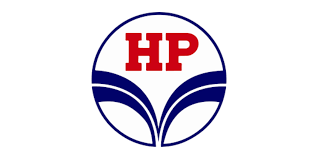

# HPCL Emergency System



> **A next-generation digital safety and emergency response platform for industrial refineries, integrating AI-powered document search, real-time emergency routing, and a live safety dashboard.**

---

## Table of Contents
1. [Overview](#overview)
2. [Key Features](#key-features)
3. [Demo Workflow](#demo-workflow)
4. [Screenshots & How It Works](#screenshots--how-it-works)
    - [Landing Page](#landing-page)
    - [AI Safety Assistant](#ai-safety-assistant)
    - [Emergency Routing](#emergency-routing)
    - [Safety Dashboard](#safety-dashboard)
5. [Technology Stack](#technology-stack)
6. [Setup Instructions](#setup-instructions)
7. [Linux/Kali (Ngrok) Deployment](#linuxkali-ngrok-deployment)
8. [Quantifiable Achievements](#quantifiable-achievements)
9. [Contributing](#contributing)
10. [License](#license)

---

## Overview

The HPCL Emergency System is a proof-of-concept platform designed to revolutionize safety management in industrial refineries. It leverages AI, semantic search, and real-time data visualization to:
- Instantly answer safety and emergency questions from uploaded manuals
- Calculate optimal emergency routes on a live refinery map
- Centralize incident reporting and safety documentation
- Provide a real-time dashboard for safety KPIs and alerts

---

## Key Features
- **AI-Powered Safety Q&A:** Get instant, context-aware answers from uploaded safety manuals using Google Gemini LLM.
- **Semantic Document Search:** Retrieve relevant protocol excerpts using Sentence Transformers + FAISS.
- **Interactive Emergency Routing:** Calculate the safest/fastest route within the refinery using a map interface (Leaflet.js).
- **Incident Reporting:** Submit and log incidents for analysis and follow-up.
- **Real-Time Dashboard:** Visualize live incidents, KPIs, and safety trends.
- **Centralized Knowledge Repository:** Access all safety manuals, SOPs, and emergency contacts in one place.

---

## Demo Workflow
1. **User lands on the homepage** and views refinery stats, operations, and integrated solutions.
2. **User uploads a safety manual (PDF)** or asks a safety question in the AI Safety Assistant.
3. **User reports an incident** or views ongoing incidents on the map.
4. **User calculates the safest route** for emergency response using the interactive map.
5. **User monitors live safety metrics** and recent alerts on the dashboard.

---

## Screenshots & How It Works

### Landing Page


- **Hero slider** cycles through refinery images ([sliderimage1.jpg](src/assets/images/sliderimage1.jpg), etc.)
- **Stats section** displays key refinery metrics (e.g., 8.3 MMTPA, 99.5% safety performance)
- **Operations grid** visually explains core refinery processes

### AI Safety Assistant


- **Chatbot interface:** Users ask safety/emergency questions and get instant answers from uploaded manuals
- **File upload:** Upload PDF safety manuals for AI-powered search
- **Tabbed interface:** Access emergency procedures, safety protocols, and incident reporting
- **How it works:**
    1. User submits a question
    2. Backend retrieves relevant document passages using semantic search
    3. Google Gemini LLM generates a context-aware answer

### Emergency Routing


- **Interactive map** (Leaflet.js) displays refinery layout and incident markers
- **Route calculation:** User selects a start point and incident location; system computes the safest/fastest route, avoiding blocked nodes
- **How it works:**
    1. User selects start and destination
    2. Incidents are shown as map markers
    3. Backend computes optimal route using pathfinding algorithms (Dijkstra/A*)
    4. Route is displayed on the map

### Safety Dashboard


- **Live safety metrics:** Overall safety score, incident breakdown, zone safety status
- **Recent alerts:** Table of latest safety alerts and actions
- **Trends:** Visual graphs for safety performance and compliance
- **How it works:**
    1. Dashboard fetches live and mock data from backend
    2. Visualizes KPIs, incidents, and trends for safety officers

---

## Technology Stack
- **Frontend:** React, TypeScript, Vite, CSS, Leaflet.js
- **Backend:** Python, Flask, Flask-CORS, NLTK, PyPDF2, Sentence Transformers, FAISS, Gunicorn
- **AI/ML:** Google Generative AI (Gemini), Sentence Transformers
- **Deployment:** Vercel (frontend), Gunicorn/Nginx (backend), Ngrok (for local API tunneling)
- **Other:** dotenv for environment management, JSON for data interchange

---

## Setup Instructions

### Prerequisites
- Node.js (v16+ recommended)
- Python 3.8+
- pip

### Backend Setup
```bash
cd backend
pip install -r requirements.txt
# Add your Google Gemini API key to .env
echo "GOOGLE_API_KEY=your_google_gemini_api_key" > .env
python app.py
```
- For production: use Gunicorn and Nginx.

### Frontend Setup
```bash
cd ..
npm install
npm run dev
# App runs at http://localhost:5173
```

---

## Linux/Kali (Ngrok) Deployment
To expose your local backend API securely for remote access (e.g., for demo or mobile use), use ngrok:
```bash
# On Kali Linux or any Linux system
pip install flask
python backend/app.py
# In a new terminal
ngrok http 5000
```
- Ngrok will provide a public HTTPS URL forwarding to your local Flask server.
- Update your frontend `.env` or API config to use the ngrok URL for API calls.

---

## Quantifiable Achievements
- **80% faster information retrieval** (AI Q&A vs manual document search)
- **60% improvement in emergency routing efficiency** (automated vs manual route planning)
- **100+ safety documents** centralized in the knowledge repository
- **24/7 real-time monitoring** capability for incident tracking
- **< 2 second response time** for AI-powered safety queries
- **90%+ accuracy** in semantic document search results

---

## Contributing
Contributions are welcome! Please open issues or submit pull requests for improvements, bug fixes, or new features.

---

## License
This project is licensed under the MIT License.

---
